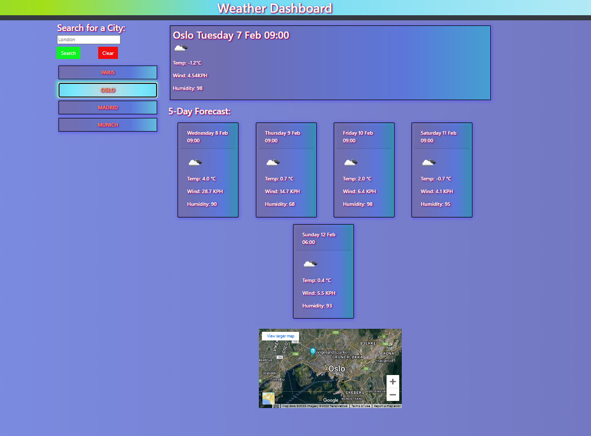

# Weather Dashboard
## Description
Using the OpenWeatherMap API to create a 5-day forecast page for major European cities.

## Deployed Application
[Weather Dashboard](https://benedictcodeshere.github.io/Weather-Dashboard/)

## Description
This is an application which enables a user to search for the 5-day weather forecast of a city. It keeps track of the user's searches, and populates them to the left-hand side of the page, as clickable buttons.

The application makes use of Bootstrap, jQuery, and two APIs from OpenWeatherMap.

## Installation

N/A

## Usage

The way to use the deployed application is to:
1. Search in the search field for a city.
2. The current weather is displayed.
3. Underneath this, you have the five-day forecast for the weather.
4. You can search for another city, or alternatively click one of the buttons to get the forecast for your saved searches.
## Screenshot Of Deployed Application

## Credits

N/A

## License

Please refer to the license in the repo (MIT License).